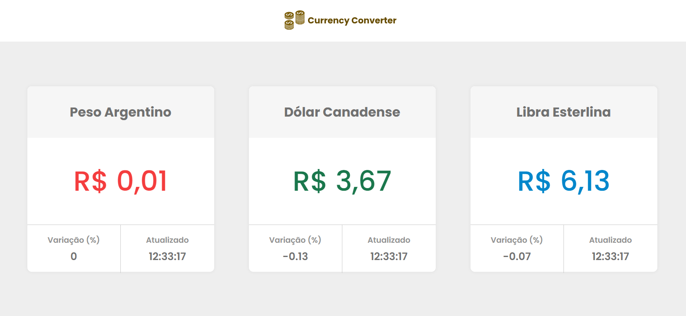
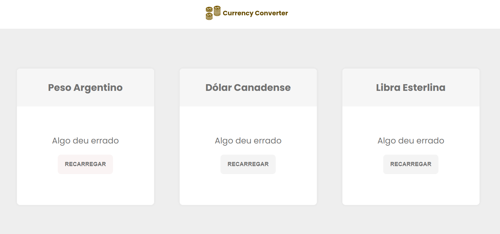
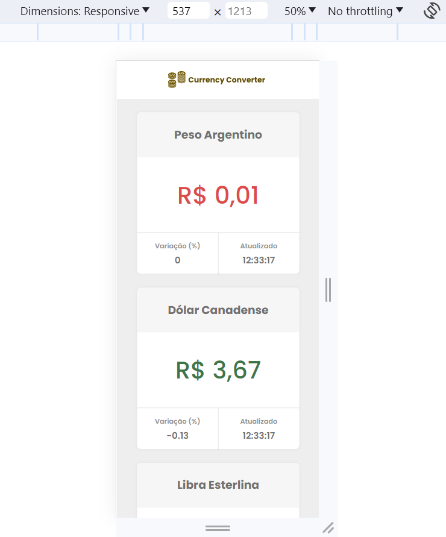

## CurrencyConverter

Sistema para conversão de três moedas para real brasilleiro(BRL).

Funcionalidades: 

- Mostra a quantia equivalente de uma unidade de cada moeda abaixo em Real Brasileiro (BRL);
- Exibe a variação em porcentagem;
- Exibe a hora da atualização;
- Os valores menores ou igual a R$ 1,00 são exibidos em vermelho;
- Os valores maiores que R$ 1,00 e menores ou igual a R$5,00 são exibidos em verde;
- Os valores maiores que R$ 5,00 são exibidos em azul;
- As informações são atualizadas automaticamente a cada 3 minutos;

### Tecnologias utilizadas 
- Angular@16.2.3
- TypeScript
- RXJS
- SASS

### Rodar projeto 

### Passo 1
Para rodar o projeto em localhost, seguir os passos abaixo:

1. `git clone https://github.com/Roseffc/currencyConverter.git`
2. `cd currencyConverter`
3. `npm install`
4. `ng serve`

### Passo 2 

2.1 Abrir o browser com esse link http://localhost:4200/home

### Demo do Sistema
- [Currency Converter] (https://currency-converter-sooty-mu.vercel.app/home)

### Interfaces

| Desktop | 
|:-------------:|
||

| Feedback Error | 
|:-------------:|
||

| Mobile | 
|:-------------:|
||

### Referências:

- [Angular CLI Overview and Command Reference](https://angular.io/cli)
- [API awesome](https://docs.awesomeapi.com.br/api-de-moedas)

